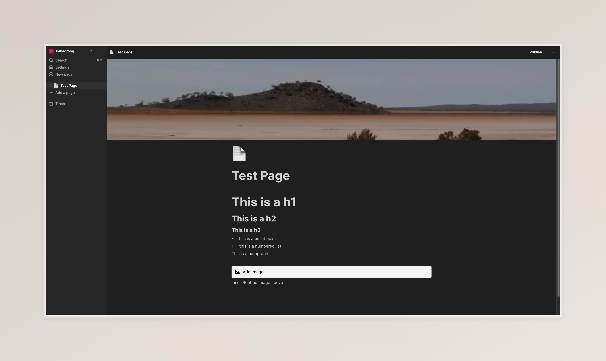
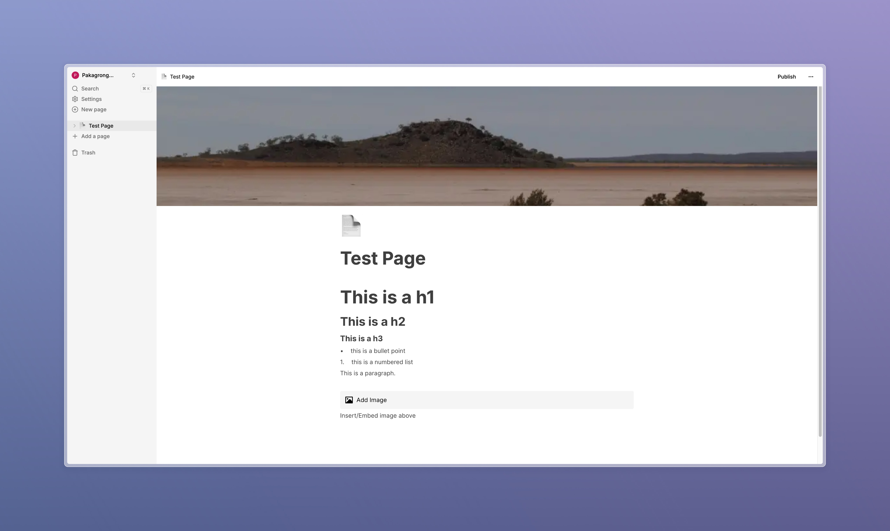

# 📝 Notion Clone - Full Stack Application

A full-featured Notion-like workspace application built following Code with Antonio's tutorial, featuring real-time collaboration, rich text editing, and file management. You can follow his tutorial 





## 🚀 Tech Stack


## ✨ Features

- 📝 Real-time database with Convex
- 🔐 Authentication using Clerk
- 📁 File upload using EdgeStore
- 📱 Full responsiveness
- ⌨️ Rich text editor
- 🎨 Light and Dark mode
- 📊 Expandable sidebar
- 🔄 Real-time updates
- 🗂️ Infinite children documents
- ⚡ Publish to web feature
- 🔍 Search functionality
- 🎯 Sort and filter options
- ⚙️ Settings for customization
- 🖼️ Icons for each document
- 📱 Full mobile responsiveness

## 🛠️ Installation Steps

1. Clone the repository:
```bash
git clone https://github.com/pakagronglb/notion-clone.git
```

2. Install dependencies
```bash
npm install
```

3. Set up environment variables
```bash
cp .env.example .env.local
```

4. Configure your environment variables:
```env
CONVEX_DEPLOYMENT=
NEXT_PUBLIC_CONVEX_URL=
NEXT_PUBLIC_CLERK_PUBLISHABLE_KEY=
CLERK_SECRET_KEY=
EDGE_STORE_ACCESS_KEY=
EDGE_STORE_SECRET_KEY=
```

5. Run the development server
```bash
npm run dev
```

## 🏗️ Project Structure

```bash
notion-clone/
├── app/
│ ├── (main)/
│ ├── (marketing)/
│ └── layout.tsx
├── components/
│ ├── ui/
│ └── providers/
├── convex/
│ ├── documents.ts
│ └── schema.ts
└── public/
```

## 🤝 Contributing

Contributions are welcome! Please feel free to submit a Pull Request.

## 📝 License

This project is [MIT](LICENSE) licensed.

## 🙏 Acknowledgments

- [Code With Antonio](https://www.youtube.com/watch?v=0OaDyjB9Ib8) for the amazing tutorial
- [Convex](https://www.convex.dev/) for the real-time backend
- [Clerk](https://clerk.dev/) for authentication
- [Shadcn/ui](https://ui.shadcn.com/) for the UI components

## 📧 Contact

Pakagrong L - [@pakagronglb](https://twitter.com/pakagronglb)

Github Repo: [https://github.com/pakagronglb/notion-clone](https://github.com/pakagronglb/notion-clone)

